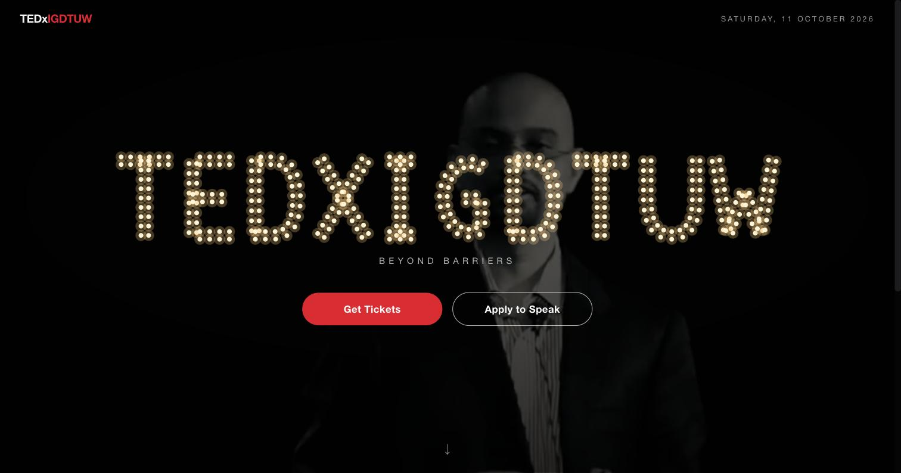
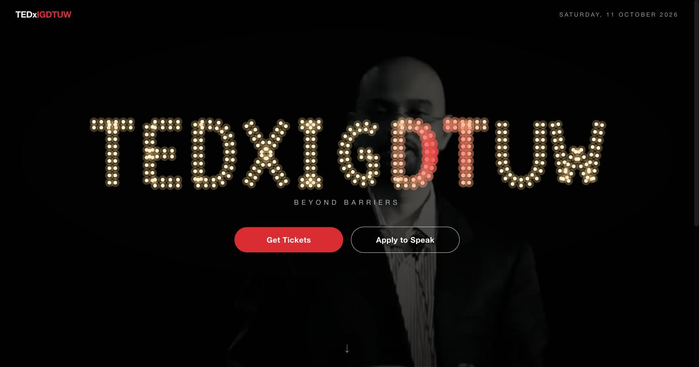
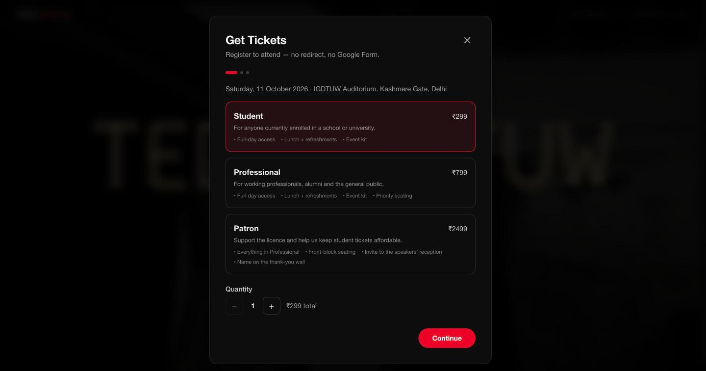
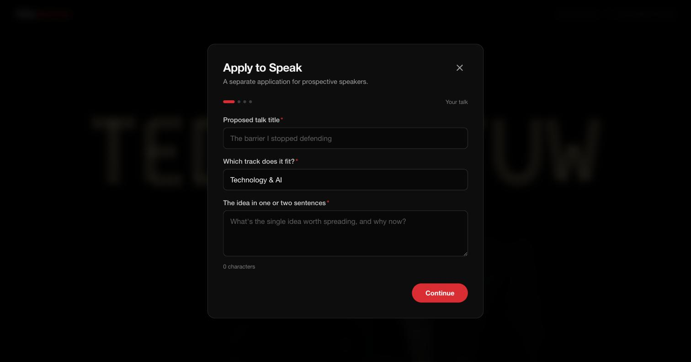

# TEDxIGDTUW — Hero, Reimagined

A single cohesive feature for [tedx-igdtuw.vercel.app](https://tedx-igdtuw.vercel.app):
an **interactive hero** that replaces the static curtain with a staged reveal, and
turns the site's one off-site call-to-action into **two clear, on-site doors —
Get Tickets and Apply to Speak.**

> Prototype for the TEDxIGDTUW Web Development practical assessment. Not affiliated
> with TED; "TEDx" is used here only to mock up the existing event site.

---

## What I built

| Part | What it does |
| --- | --- |
| **Staged hero reveal** | On load, an intro clip plays — a camera turns into view, its screen lights up with footage, and it pushes toward that screen. At the end the shot scales *into* the screen and cross-fades to the hero. |
| **Marquee bulb sign** | `TEDXIGDTUW` is rendered as a rented-style marquee letter sign — every glyph traced out in two rows of bulbs. Bulbs rest at a warm glow and **light up red where the cursor gets close**, like a real bulb sign reacting to touch. |
| **Dimmed event footage** | Behind the sign, a muted B&W loop of past TEDxIGDTUW talks plays at reduced opacity. |
| **Get Tickets** (in-site) | A 3-step registration flow — tier + quantity → attendee details (validated) → review → a mock ticket with a generated code. No redirect. |
| **Apply to Speak** (in-site) | A separate 4-step application scoped to speakers — talk idea → about you → links → review → submitted, with "what happens next". |
| **Local persistence** | Both forms save to `localStorage`. `/dev/submissions` (unlinked) is a dev-only window onto what was captured. |

## The problem it solves

The current homepage opens on a **static theatre-curtain image**. It doesn't move,
doesn't introduce the event, and its single button sends visitors **off-site to a
Google Form** — breaking the experience at the moment someone is most interested,
and funnelling two very different audiences (attendees and prospective speakers)
into one form.

This feature fixes both halves at once:

1. **A hero that performs the reveal** instead of just depicting a curtain.
2. **Two on-site entry points** — because attendees and speakers are different
   funnels with different questions and different review processes. Splitting them
   back apart is part of the fix, not an extra feature.

## Screenshots

| | |
| --- | --- |
|  |  |
| *Hero — marquee bulb sign over dimmed event footage* | *Bulbs light red where the cursor gets close* |
|  |  |
| *Get Tickets — in-site, no Google Form* | *Apply to Speak — a separate speaker application* |

## Key technical & design decisions

- **React + Vite + TypeScript + Tailwind v4.** SPA is the right shape for a
  single animated screen; no backend needed for a prototype. Tailwind v4's
  `@theme` holds the four design tokens (`ink`, `ted`, …).
- **Animation is pure CSS transitions, not a JS animation library.** I started
  with Framer Motion and removed it. CSS transitions are time-based and keep
  running when the tab is backgrounded, whereas `requestAnimationFrame`-driven
  libraries freeze mid-animation until the tab is focused — a real bug for a
  hero that auto-plays on load. Dropping it also cut the JS bundle ~120 KB.
  The sequence is a tiny state machine (`intro → reveal → hero`) driven by
  `setTimeout` + the intro `<video>`'s own `timeupdate`/`ended` events.
- **The marquee letters are sampled SVG paths.** Each glyph is one or two stroke
  paths in a normalised box (`src/components/hero/letterPaths.ts`); at render
  time the browser's `getPointAtLength` walks each path and drops a bulb every
  ~13 units, offset into two rows along the path normal for thickness. Adding a
  letter is a one-line path string.
- **Cursor glow is measured in screen space.** Each bulb's on-screen centre is
  cached (on mount, on pointer-enter, on resize/scroll); `pointermove` is a
  distance check against that cache with a `performance.now()` throttle. Colour
  and halo interpolate warm-white → red by proximity.
- **CTAs are modals *and* linkable.** They open as dialogs but also work as
  `?modal=tickets` / `?modal=speak` URLs — shareable and back-button friendly.
  Deep-linking a modal skips the intro so the visitor isn't stuck behind it.
- **Accessibility.** `prefers-reduced-motion` skips the whole reveal to the
  resting hero; the intro is skippable by button or any keypress; modals trap
  focus, close on Esc/backdrop, lock body scroll; all inputs have real labels
  and `aria-invalid`.
- **Video pipeline.** The source clips are screen recordings (HEVC, full-range).
  `scripts/encode-hero.mjs` normalises them to web-safe H.264 / `yuv420p` /
  `+faststart` via `ffmpeg-static` — browsers' demuxers stall silently on the
  raw files. Output: `intro.mp4` (~0.75 MB), `hero-loop.mp4` (~3 MB).

## Run it

```bash
npm install
npm run dev            # http://localhost:5173
npm run build          # typecheck + production build
```

Re-encode the hero footage from a new source:

```bash
node scripts/encode-hero.mjs "/path/to/clip.mov"
```

## Deploy

Zero-config on Vercel (`vercel.json` handles SPA routing). Any static host works —
serve `dist/` with a catch-all rewrite to `/`.

## AI tools used

- **Claude (Claude Code)** — paired on the whole build: scaffolding, the
  path-sampling marquee, the CSS-transition state machine, form validation, and
  debugging the video-codec issue. I reviewed and understand every file; the
  design decisions above are the ones I made and can defend.
- The source video clips are my own screen recordings; `ffmpeg` (via
  `ffmpeg-static`) did the transcoding.

## What I'd improve with more time

- **Passcode-gated review page.** `/dev/submissions` previews it, but a real
  team view of Get Tickets / Apply to Speak submissions needs auth and real
  storage — a separate feature with its own risk surface, so it's noted rather
  than rushed.
- **Real ticket codes.** The success screen shows a QR-styled block generated
  from the ticket id; it isn't a scannable code. Real ticketing issues one
  server-side.
- **Intro polish.** The intro clip still carries its social-media UI chrome; a
  clean re-cut on a black background would match the site better. The hand-off
  into the hero could also share a single continuous video rather than a
  cross-fade.
- **Backend.** Swap `localStorage` for a real endpoint (Vercel function +
  a DB / a form service) and send confirmation emails.
- **Tests.** Unit-test the form validation and the path sampler; a visual
  regression check on the hero.
